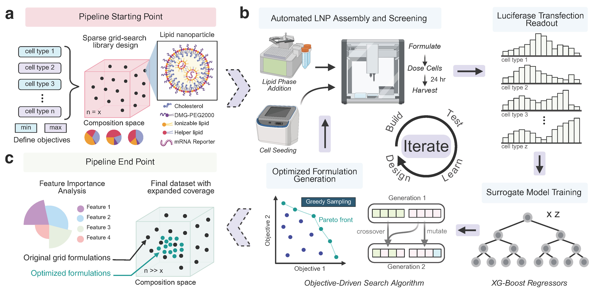

# falcon-lnp-optimization
Repository for the paper "FALCON: Closed Loop Multi-Objective Optimization of Lipid Nanoparticles for Cell-Selective mRNA Delivery"

## 🦅 What is FALCON?

**FALCON** (_**F**ramework for **A**ctive-**L**earning driven **C**ompositional **O**ptimization of **N**anoparticles_) is a closed-loop experimental-computational pipeline developed by the [Hai-Quan Mao Lab](https://maogroup.jhu.edu/) for intelligent and accelerated design of cell type-selective lipid nanoparticle (LNP) formulations.  

####  Features:

- **Multi-objective optimization.** Learns to simultaneously *maximize* delivery to desired cell types while *minimizing* off-target effects, improving the efficacy and safety profile of LNPs.

- **Data-efficient formulation design.** Uses a _sparse initial dataset_ to begin optimization and can rapidly identify high-performing candidates to test, reducing experimental burden.

- **Exhaustive and rational search.** Surrogate model-guided search algorithms test _hundreds of thousands_ of candidates in silico, outperform brute-force grid search in experiments, and enable interpretability of cell type-selective design principles.
  
- **Modular architecture**. Framework can be applied for different cell types, input parameters, and optimization goals.
  

<strong>Figure 1. Schematic Overview of FALCON Workflow</strong>


  
## 📁 Repository Overview

This repository contains all code and scripts needed to reproduce the FALCON pipeline, including model training, optimization, visualization, and analysis.
- Model outputs and derived plots (e.g., optimization trajectories, SHAP results, PCA) can be generated using the code and scripts provided in this repository.


**Directory Structure**

```bash
falcon-lnp-optimization/
├── run_FALCON.py                       # Top-level script to launch full pipeline
├── falcon_engine/                      # Core code modules (cross validation, model selection, optimization, formatting, etc.) 
├── notebooks/                          # Interactive Jupyter notebooks for plotting 
│   ├── plot_model_performance.ipynb       
│   ├── plot_optimization_search.ipynb    
│   ├── plot_PCA.ipynb                     
│   └── plot_SHAP_analysis.ipynb          
├── output/                             # Gnerated suggestions, trained models, plots, logs
│   ├── sample_demo/                             # Example output of a demo run 
├── datasets/                           # Input dataset directory
├── exp_templates/                      # Template formulation sheets and destination for formatted LNP suggestions
└── environment.yml                     # Conda environment file specifying required dependencies
```


## ⚙️ Environment Setup  

We recommend using **Anaconda** to create a clean, reproducible environment that supports both Python and R.

Clone this repo and run:

```bash
conda env create -f environment.yml
conda activate falcon-env

```

<details> <summary><strong> More information on setting up a conda environment </strong> (Click to expand)</summary>

1. **Install [Anaconda](https://www.anaconda.com/products/distribution)**  
   This includes **Python**, **Conda**, and **Jupyter Notebook** — everything you need to run this project.

2. _(Optional but recommended)_ **Install [Visual Studio Code (VS Code)](https://code.visualstudio.com/)**  
   A lightweight, user-friendly code editor that works well with Conda and Jupyter.

3. Once installed, open:
   - **Anaconda Prompt** (on Windows), or  
   - **Terminal** (on macOS/Linux)

4. Then follow the environment setup instructions above to create and activate the environment.

> 💡 You do *not* need to install Python separately — Anaconda handles that for you.

</details> 

## ⚙️ System Requirements
- Developed and tested on Windows 11 Pro (64-bit)
- RAM: 8 GB minimum recommended (demo dataset uses ~2 GB during execution)
- Typical install time: ~30 minutes on a standard laptop (16 GB RAM, SSD, stable internet connection)
- GPU: Not required, runs on CPU

## 🧪 Running FALCON

The `run_FALCON.py` script executes the full computational pipeline:

- **Part 1 – Surrogate Model Training**:  
  Trains XGBoost models to predict LNP transfection for each specified cell type.

- **Part 2 – Optimization**:  
  Applies ML-guided search (e.g., NSGA-II, Bayesian Optimization, Dual Annealing, I-Optimal Sampling) to identify optimal LNP compositions.

- **Part 3 – (Optional) MANTIS Formatting**:  
  Formats selected LNP compositions into a template compatible with robotic experimentation (e.g., MANTIS).

> 💡 Each part of the pipeline can be run independently using flags inside the script (`run_model`, `run_optimization`, `run_mantis_formatter`).

Before running, ensure:
- Your dataset (`.csv`) is correctly formatted and placed in the `datasets/` folder.
- Key script parameters are correct set:
  - `DATASET_NAME`: name of your dataset file
  - `RUN_NAME`: name of output folder
  - `input_param_names`: list of features used for model training
  - `MAX_cell_targets`, `MIN_cell_targets`: target cell types for optimization
  - `opt_methods` : search methods to use for optimization
  - `num_formulations` : number of formulations to generate
  - `raw_suggestion_bounds` : hard cutoff for searchable parameter values
  - `diversity_threshold` : minimum required diversity of a new suggested formulation

### ▶️ To Run

Make sure you are in the project **root directory** (`falcon-lnp-optimization/`), then run:

```bash
python run_FALCON.py
```

### Demo 
- run_FALCON.py is configured with demo dataset from the manuscript (follow above instructions to run)  
- Demo dataset full pipeline (2 cell types, 4 search algorithms) runtime: ~17 minutes (6 minutes model training, 11 minutes optimization search)
- Sample output for demo can be found in `output/sample_demo`

### 📊 Interactive Analysis 

Notebooks in the [`notebooks/`](notebooks/) directory are provided as interactive plots to visualize model performance and optimization behavior:

- [SHAP feature importance](notebooks/plot_SHAP_analysis.ipynb)
- [PCA of formulation space](notebooks/plot_PCA.ipynb)
- [Pareto front and convex hull](notebooks/plot_optimization_search.ipynb)
- [Validation curves and learning diagnostics](notebooks/plot_model_performance.ipynb)

## Code Contributors

- Enoch Toh  
- Leonardo Cheng  
- Charles Shin  
- Brandon Chang


## Which Runner Should I Use?

Use `run_FALCON.py` for new datasets. It is the canonical universal entry point. Configure only:

- `DATASET_NAME` / `RUN_NAME`
- `input_param_names`
- `MAX_cell_targets` / `MIN_cell_targets`
- optional `raw_suggestion_bounds` overrides

`run_FALCON_NP.py` is kept as the current nanoparticle example configuration. `run_FALCON_original.py` is a legacy RAMOS/THP1 demo runner retained for reference.

LNP-specific names such as `Ionizable_lipid` and `Helper_lipid` are not required for universal training or optimization. They may still appear in old demo datasets and in the optional MANTIS formatter, which is a legacy liquid-handler export path for the original LNP composition format. For generic datasets, leave `run_mantis_formatter = False` and leave `carry_forward_metadata_cols = []`.

## Universal Input Parameter Names

This copy supports arbitrary numeric input feature columns. Configure each run by editing `run_FALCON_NP.py`:

- `DATASET_NAME`: CSV file name under `datasets/`, without `.csv`
- `input_param_names`: feature/input columns used for training and optimization
- `MAX_cell_targets` and `MIN_cell_targets`: output/response columns to optimize
- `raw_suggestion_bounds`: optional raw-unit search bounds

Set `raw_suggestion_bounds = None` to infer optimization bounds from the actual dataset used in the run. FALCON will use the observed min/max of every configured input feature and print whether each bound came from the dataset or a manual override.

You can also provide a partial override dictionary:

```python
raw_suggestion_bounds = {
    "DS_MW": (10000, 1000000),
}
```

Any input feature not listed in the override dictionary uses its dataset-derived range. Input columns must be numeric and have at least two distinct non-missing values for optimization.

